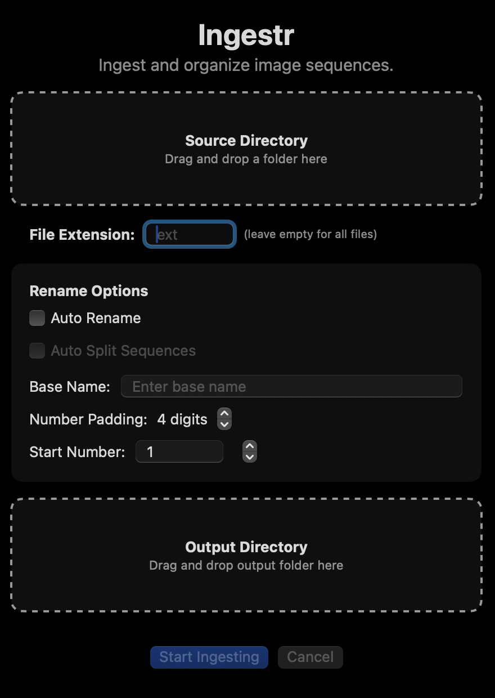

# Ingestr

A modern macOS application for ingesting and organizing image sequences. Ingestr automatically organizes your images into date-based folders and handles sequence detection and naming.



## Features

- **Smart Sequence Detection**: Automatically detects and organizes image sequences based on capture time
- **Auto Rename**: Uses EXIF date from images to create organized folder structures
- **Auto Split**: Automatically splits sequences when significant time gaps are detected
- **Extras Handling**: Small sequences (< 10 images) are automatically moved to an "Extras" folder
- **Clean, Modern Interface**: Drag-and-drop UI with native macOS controls
- **File Extension Filtering**: Filter files by extension (e.g., "jpg", "raw")
- **Progress Tracking**: Real-time progress monitoring for large batches
- **Dark/Light Mode Support**: Automatically adapts to your macOS appearance settings

## Why this exists

We shoot time lapse photography and video. This means that we end up with hundreds or thousands of still images on a memory card from a shoot or set of shoots. We regularly need to ingest these images into central storage (or server) in a structured way, renamed to indicate which images belong together in a coherent sequence. 

If you have the same or similar needs, this app might be useful to you. If so, enjoy!

## Requirements

- macOS 12.0 or later
- 64-bit processor
- Permissions to access files/folders you want to ingest

## Installation

1. Download the latest release from the [Releases](https://github.com/timelapsetech/ingestr/releases) page
2. Drag `Ingestr.app` to your Applications folder
3. Launch from Applications or Spotlight
4. When prompted, grant the app permission to access your files and photos

## Usage

### Basic Ingesting

1. Launch Ingestr
2. Drag and drop a source folder containing your images onto the "Source Directory" zone
3. Drag and drop a destination folder onto the "Output Directory" zone
4. Configure your options (see below)
5. Click "Start Ingesting"

### Options Explained

#### File Extension Filter
- Enter a file extension (e.g., "jpg", "raw") to only process files with that extension
- Leave empty to process all files

#### Auto Rename
- When enabled, uses the EXIF date from the first image in each sequence to create the folder name
- Format: `YYYYMMDDXCO_` where:
  - `YYYYMMDD` is the date from the image
  - `X` is an incrementing sequence number
  - `CO` indicates it's a camera original
- When disabled, you can enter a custom base name

#### Auto Split Sequences
- Only available when Auto Rename is enabled
- Automatically detects time gaps between images
- Creates new sequences when a significant time gap is detected
- Helps organize photos from different shooting sessions

#### Base Name
- Only available when Auto Rename is disabled
- Enter a custom prefix for your files
- Files will be numbered sequentially after this prefix

#### Number Padding
- Controls how many digits to use in the sequence number
- Example: With padding of 4, files will be numbered 0001, 0002, etc.

#### Start Number
- Choose which number to start the sequence from
- Useful when continuing a previous sequence

### Output Structure

The app creates the following folder structure:

```
Output Directory/
└── YYYY/                    # Year folder
    ├── YYYYMMDD1CO_/        # First sequence of the day
    │   ├── YYYYMMDD1CO_0001.jpg
    │   ├── YYYYMMDD1CO_0002.jpg
    │   └── ...
    ├── YYYYMMDD2CO_/        # Second sequence of the day
    │   ├── YYYYMMDD2CO_0001.jpg
    │   └── ...
    └── Extras/              # Small sequences and non-sequential images
        ├── YYYYMMDD-HHMMSS.jpg
        └── ...
```

### Completion

After ingesting completes:
- If all images were organized into sequences, you'll see a message indicating success
- If any images were moved to the Extras folder, you'll be notified
- You can click "Open Folder" to view the results in Finder

## Development

### Setup
1. Clone the repository
2. Open `Ingestr.xcodeproj` in Xcode
3. Build and run the project

### Requirements
- Xcode 14.0 or later
- Swift 5.5+

## Credits

- Icon design: Time Lapse Technologies
- Developer: Time Lapse Technologies

## License

Copyright © 2025 Time Lapse Technologies. All rights reserved. 