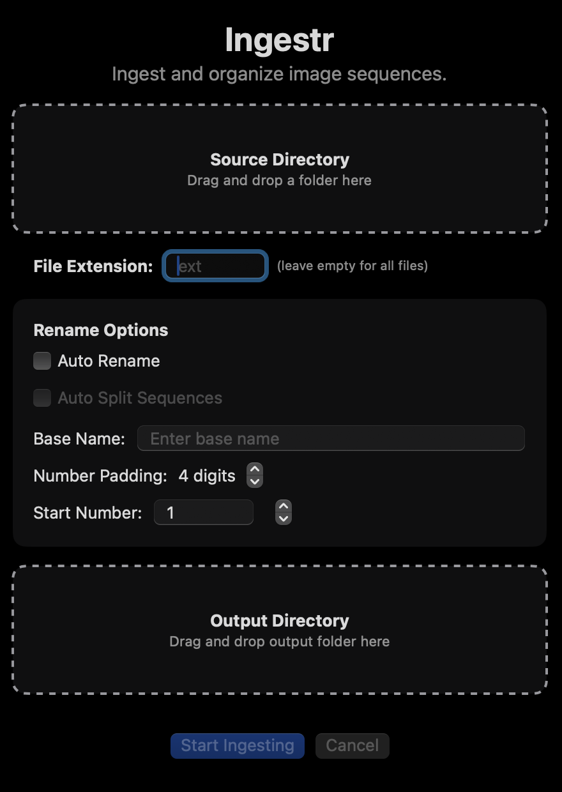

# Ingestr

A modern macOS application for ingesting and organizing images. Use **sequence mode** for time-lapse and shot groups, or **photo mode** to file every image by capture date into year/month/day folders with a timestamped name.

**Current release:** 1.4 — see [CHANGELOG.md](CHANGELOG.md) for release notes.



## Features

- **Sequence mode or Photo mode**: **Sequence mode** (default) detects sequences, supports auto rename, split, and Extras. **Photo mode** skips sequence logic and writes each file to `Year/Month/Day` with a `yyyy-MM-dd-HHmmss-SSS` filename from capture time.
- **Smart Sequence Detection**: Automatically detects and organizes image sequences based on capture time
- **Auto Rename**: Uses EXIF date from images to create organized folder structures
- **Auto Split**: Automatically splits sequences when significant time gaps are detected
- **Extras Handling**: Small sequences (< 10 images) are automatically moved to an "Extras" folder
- **Clean, Modern Interface**: Drag-and-drop UI with native macOS controls
- **File Extension Filtering**: Filter files by extension (e.g., "jpg", "raw")
- **Progress Tracking**: Real-time progress monitoring for large batches; copy phase names the active file before long full-verification runs
- **Dark/Light Mode Support**: Automatically adapts to your macOS appearance settings
- **Add to Existing**: When enabled, the app will detect the last number in an existing image sequence in the destination and continue numbering from there, matching the zero-padding of existing files. This is useful for appending new images to an already-ingested sequence without overwriting or duplicating numbers.

## Why this exists

We shoot time lapse photography and video. This means that we end up with hundreds or thousands of still images on a memory card from a shoot or set of shoots. We regularly need to ingest these images into central storage (or server) in a structured way, renamed to indicate which images belong together in a coherent sequence. 

If you have the same or similar needs, this app might be useful to you. If so, enjoy!

## Requirements

- macOS 12.0 or later
- 64-bit processor
- Permissions to access files/folders you want to ingest

## Installation

1. Download the latest release from the [Releases](https://github.com/timelapsetech/ingestr/releases) page (use the release asset that contains `Ingestr.app`, not the “Source code” zip, which is only the repository and must be built in Xcode).
2. Drag `Ingestr.app` to your Applications folder
3. Launch from Applications or Spotlight
4. When prompted, grant the app permission to access your files and photos

### macOS “malware” or “can’t be opened” (Gatekeeper)

Downloads are marked as quarantined. If the app is not **Developer ID** signed and **notarized**, macOS may say it cannot verify the app or that it may harm your Mac. That is Gatekeeper, not a virus scan of the project.

- **First launch:** Control-click (right-click) `Ingestr.app`, choose **Open**, then confirm **Open** in the dialog. After that, double-click works normally.
- **Alternatively:** System Settings → Privacy & Security → scroll to the message about the app and click **Open Anyway** (wording varies by macOS version).

For distribution without that prompt, maintainers should archive with a **Developer ID** certificate and **notarize** the app with Apple before uploading the zip to Releases.

## Usage

### Basic Ingesting

1. Launch Ingestr
2. Drag and drop a source folder containing your images onto the "Source Directory" zone
3. Drag and drop a destination folder onto the "Output Directory" zone
4. Configure your options (see below)
5. Click "Start Ingesting"

### Options Explained

#### Ingest mode (Sequence vs Photo)
- **Sequence mode**: Same behavior as previous releases—images are grouped into sequences by capture time; small sets may go to **Extras**; **Rename Options** below apply.
- **Photo mode**: Does not build sequences. Each matching file is copied to **`Output/YYYY/MM/DD/`** (zero-padded month and day) and renamed to **`yyyy-MM-dd-HHmmss-SSS.ext`** using EXIF (or file date as fallback). Milliseconds keep names unique; if a name still exists, `_2`, `_3`, … are appended before the extension. **Rename Options** that only apply to sequences (Auto Rename, Auto Split, Add to Existing, Base Name, padding, start number) are disabled in photo mode. **Copy verification** still applies.

Hover each mode in the app for an example output path in the tooltip.

#### File Extension Filter
- Enter a file extension (e.g., "jpg", "raw") to only process files with that extension
- Leave empty to process all files

#### Auto Rename
- When enabled, uses the EXIF date from the first image in each sequence to create the folder name
- Format: `YYYYMMDDXCO_` where:
  - `YYYYMMDD` is the date from the image
  - `X` is an incrementing sequence number
  - `CO` indicates it's a camera original
- When disabled, you can enter a custom base name

#### Auto Split Sequences
- Only available when Auto Rename is enabled
- Automatically detects time gaps between images
- Creates new sequences when a significant time gap is detected
- Helps organize photos from different shooting sessions
- If every gap is filtered out (for example identical capture timestamps), ingest continues as **one** sequence instead of stopping with an error

#### Copy verification
- **Full** (default): streams each file while hashing, then hashes the destination to confirm a byte-for-byte match (extra disk read of the written file).
- **None**: copies files with the system copy API only—fastest; same as early releases when verification was not offered.
- **Size only**: after copy, compares source and destination file sizes (very low overhead; does not detect same-size corruption).

Your choice is saved between launches. Existing installs that already saved **None** or **Size only** keep that setting until you change it.

#### Base Name
- Only available when Auto Rename is disabled
- Enter a custom prefix for your files
- Files will be numbered sequentially after this prefix

#### Number Padding
- Controls how many digits to use in the sequence number
- Example: With padding of 4, files will be numbered 0001, 0002, etc.

#### Start Number
- Choose which number to start the sequence from
- Useful when continuing a previous sequence

#### Add to Existing
- When enabled, the app will scan the destination for existing files matching the base name and continue numbering from the next available number, matching the existing zero-padding. This ensures new images are appended to the sequence seamlessly.

### Output Structure

**Sequence mode** creates:

```
Output Directory/
└── YYYY/                    # Year folder
    ├── YYYYMMDD1CO_/        # First sequence of the day
    │   ├── YYYYMMDD1CO_0001.jpg
    │   ├── YYYYMMDD1CO_0002.jpg
    │   └── ...
    ├── YYYYMMDD2CO_/        # Second sequence of the day
    │   ├── YYYYMMDD2CO_0001.jpg
    │   └── ...
    └── Extras/              # Small sequences and non-sequential images
        ├── YYYYMMDD-HHMMSS.jpg
        └── ...
```

**Photo mode** creates (example):

```
Output Directory/
└── YYYY/
    └── MM/
        └── DD/
            ├── yyyy-MM-dd-HHmmss-SSS.jpg
            └── ...
```

### Completion

After ingesting completes:
- **Sequence mode:** If all images were organized into sequences, you'll see a message indicating success; if any images were moved to the Extras folder, you'll be notified
- **Photo mode:** Completion opens the relevant year folder when applicable
- You can click **Open Folder** to view the results in Finder (the app restores sandbox access to your chosen destination so Finder can open it after ingest)

## Development

### Setup
1. Clone the repository
2. Open `Ingestr.xcodeproj` in Xcode
3. Build and run the project

### Requirements
- Xcode 14.0 or later
- Swift 5.5+

### Testing
- The project now includes automated unit tests for sequence detection, filename generation, and add-to-existing logic. Run tests with Cmd+U in Xcode to ensure continued reliability after changes.

## Credits

- Icon design: Time Lapse Technologies
- Developer: Time Lapse Technologies

## License

Copyright © 2025 Time Lapse Technologies. All rights reserved. 